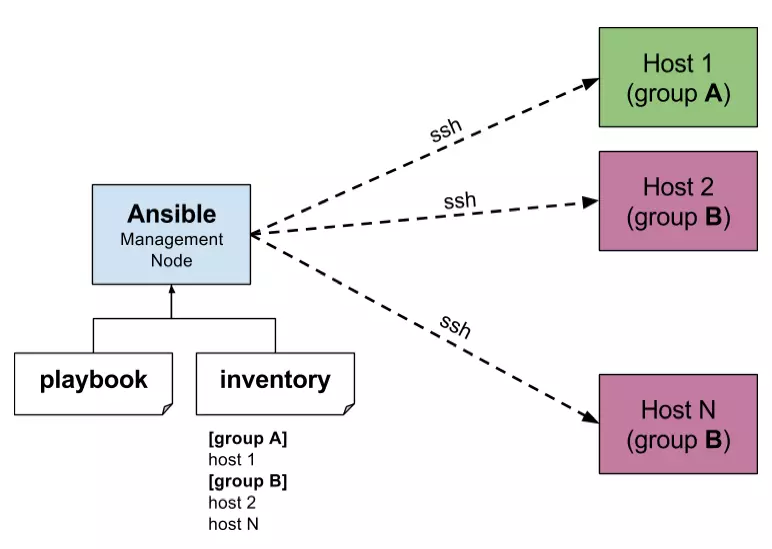
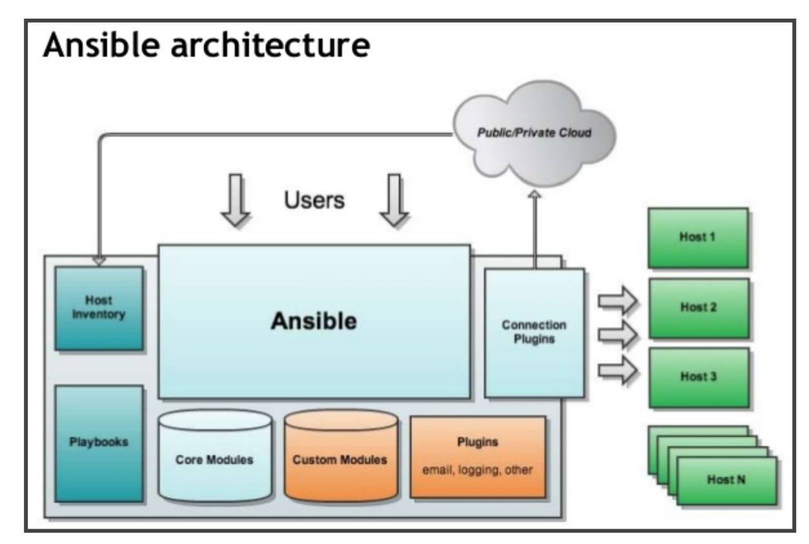
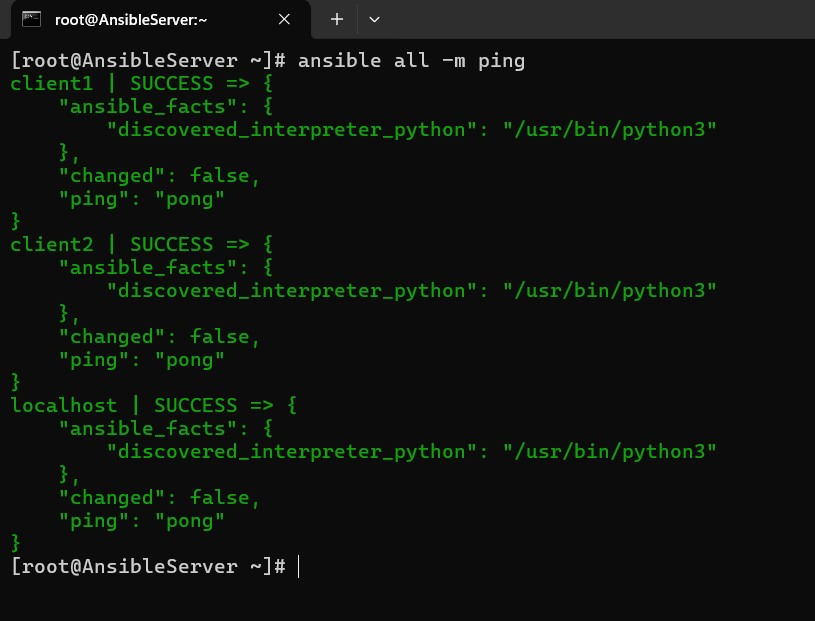
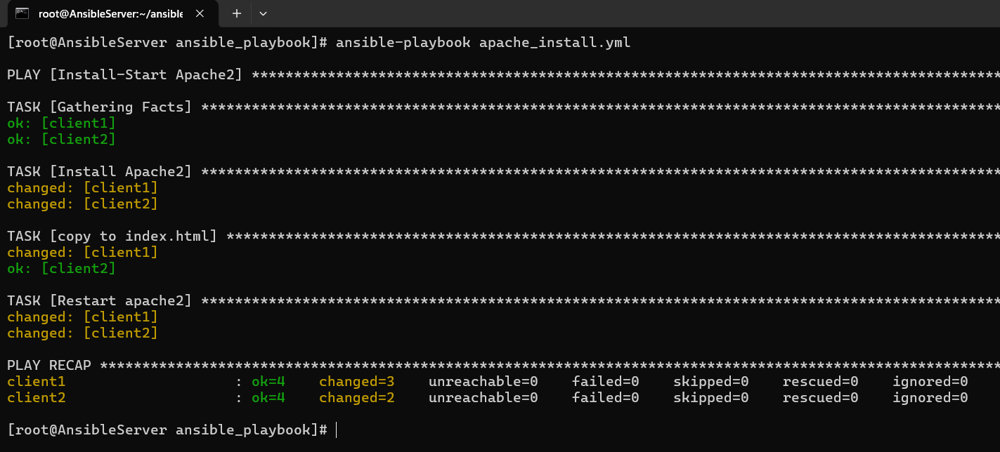

# Tổng quan về Ansible
### Ansible là gì?
**Ansible** là một công cụ tự động hóa mã nguồn mở được sử dụng để cấu hình hệ thống, triển khai ứng dụng, và quản lý các tác vụ IT khác. Ansible sử dụng ngôn ngữ YAML để định nghĩa các tác vụ cần thực hiện, giúp dễ dàng đọc và viết. Ansible hoạt động mà không cần agent, nghĩa là bạn không cần cài đặt phần mềm client trên các máy chủ đích, mà thay vào đó Ansible sẽ kết nối và thực thi các lệnh qua SSH.


### Các khái niệm cơ bản trong Ansible
- **Host**: Một máy chủ hoặc thiết bị được quản lý bởi Ansible.
- **Var**: Biến số được sử dụng trong các playbook để lưu trữ thông tin cấu hình hoặc dữ liệu khác.
- **Group**: Một tập hợp các host. Các host có thể được nhóm lại để áp dụng cấu hình hoặc tác vụ chung.
- **Inventory**: Tập tin hoặc tập hợp các tập tin liệt kê tất cả các host và nhóm của chúng. Inventory có thể là tĩnh hoặc động (dynamic inventory).
- **Dynamic Inventory**: Một phương pháp để tự động cập nhật inventory dựa trên các nguồn dữ liệu bên ngoài như cloud, database hoặc các dịch vụ web khác.
- **Play**: Một tập hợp các nhiệm vụ (task) được áp dụng cho một nhóm các host.
- **Playbook**: Tập hợp các play. Đây là tệp YAML mô tả các bước cần thực hiện để cấu hình hệ thống hoặc triển khai ứng dụng.
- **Task**: Một tác vụ cụ thể được thực hiện trên một host, ví dụ như cài đặt phần mềm, sao chép tệp tin hoặc chạy lệnh.

### Cấu trúc Ansible

- **Người dùng (User)** là các quản trị viên hoặc nhà phát triển, sử dụng Ansible để thực hiện các tác vụ tự động hóa trên các máy chủ. Người dùng tương tác với Ansible thông qua các lệnh CLI hoặc các playbook.

- **Host Inventory** là danh sách các máy chủ mà Ansible sẽ quản lý. Inventory có thể ở dạng tĩnh (static inventory) hoặc động (dynamic inventory).
    - ***Static Inventory***: Là một tệp tin (thường là hosts hoặc inventory) chứa danh sách các máy chủ và nhóm máy chủ.
    - ***Dynamic Inventory***: Được tạo ra động từ các nguồn bên ngoài như các dịch vụ đám mây (AWS, Azure, GCP, OpenStack, v.v.).
- **Playbooks** là tập hợp các kịch bản được viết bằng YAML, chứa các plays để thực hiện các tác vụ trên các máy chủ. Mỗi playbook bao gồm một hoặc nhiều plays và mỗi play có thể chứa nhiều tasks.
- **Core Modules** là các module được tích hợp sẵn trong Ansible để thực hiện các tác vụ phổ biến như quản lý gói, dịch vụ, tệp, người dùng, v.v.
- **Custom Modules** là các module tùy chỉnh do người dùng tạo ra để thực hiện các tác vụ đặc thù không được hỗ trợ bởi các core modules.
- **Plugins** là các thành phần mở rộng chức năng của Ansible. Các loại plugins bao gồm:
    - Connection Plugins: Quản lý cách Ansible kết nối đến các máy chủ. Ví dụ: SSH cho máy chủ Linux, WinRM cho máy chủ Windows.
    - Email Plugins: Gửi email khi hoàn thành hoặc khi gặp lỗi.
    - Logging Plugins: Ghi lại log của các hoạt động Ansible.
    - Other Plugins: Bao gồm lookup, cache, callback, và nhiều loại khác.
- **Public/Private Cloud**: Ansible có thể quản lý cả hạ tầng public cloud (như AWS, Azure, GCP) và private cloud (như OpenStack) thông qua các plugin kết nối và inventory động.
- **Hosts** là các máy chủ đích mà Ansible quản lý. Mỗi host có thể là một máy chủ vật lý, máy ảo, hoặc container. Ansible thực hiện các tác vụ trên các hosts này thông qua các module và plugin kết nối.

**Tóm tắt luồng hoạt động:**
1. Người dùng tương tác với Ansible thông qua các lệnh hoặc playbook.
2. Ansible sử dụng Host Inventory để biết được các máy chủ cần quản lý.
3. Ansible sử dụng Playbooks để định nghĩa các tác vụ cần thực hiện trên các máy chủ.
4. Các Modules và Plugins được sử dụng để thực hiện các tác vụ cụ thể.
5. Ansible kết nối đến các Hosts thông qua các Connection Plugins.
6. Ansible có thể tương tác với cả Public và Private Cloud để quản lý hạ tầng đám mây.

# Cài đặt và triển khai Ansible lab

### Mô hình


### Cài đặt Ansible trên node Ansible Server
```bash
yum install -y epel-release 
yum update -y

yum install -y ansible
```

### Cấu hình SSH key cho các node hosts và khai báo file inventory 
```bash
# Tạo ssh keypair tại Ansible server
ssh-keygen

# Copy public key đến các node
ssh-copy-id root@192.168.133
ssh-copy-id root@192.168.135
```

Sau đó khai báo file inventory tĩnh tại file `/etc/ansible/hosts` mặc định của ansible. Hoặc có thể tạo file inventory khác ở đâu tùy thích nhưng khi chạy các lệnh cần thêm option để ansible đọc được file inventory. 

```
[local]
localhost ansible_host=192.168.75.131 ansible_port=22 ansible_user=root

[ubuntu]
client1 ansible_host=192.168.75.135 ansible_port=22 ansible_user=root
client2 ansible_host=192.168.75.133 ansible_port=22 ansible_user=root
```

Ở đây tôi có 2 group là local và ubuntu.
Trong 2 group có các tham số của host như ansible_host, ansible_port, ansible_user,...
- **client1, client2**: Tương ứng là các hostname của các node
- **ansible_host**: Địa chỉ IP của node client tương ứng
- **ansible_port**: Port của SSH phía client, nếu ta thay đổi thì sẽ chỉnh lại cho đúng.
- **ansible_user**: Là username của client mà AnsibleServer sẽ dùng để tương tác, trong bước trên tôi sử dụng là user root và thông qua SSH Key.

### Thực hiện các câu lệnh ad-hoc command 
Cú pháp chung của ad-hoc command trong ansible là
```bash
ansible [pattern] -m [module] -a "[module options]"

# Ví dụ kiểm tra kết nối đến tất cả các hosts 
ansible all -m ping
```

Ta được kết quả:


1 ví dụ khác sử dụng **ad-hoc command** để tại vim hàng loạt trên group ubuntu sử dụng module `apt` của ansible.


### Playbook
Sử dụng lệnh `ansible-playbook` để chạy playbook gồm nhiều plays và tasks.

Viết 1 playbook để tải và khởi chạy apache2 trên các hosts thuộc group "ubuntu"
```yml
---
  - name: Install-Start Apache2
    hosts: ubuntu
    become: yes
    tasks:
      - name: Install Apache2
        apt:
          name: apache2
          state: latest

      - name: copy to index.html
        copy:
          src: index.html
          dest: /var/www/html/index.html

      - name: Restart apache2
        service:
          name: apache2
          state: restarted
          enabled: true
```

Kết quả khi chạy playbook này:

Như trong output trên, ta thấy rằng 3 task có tên là **Install Apache2**, **copy to index.html** và **Restart apache2** mà ta đã định nghĩa trong playbook đã được thực hiện thành công. Nhưng trước khi thực hiện 2 task này, ansible đã thực hiện 1 task có tên là **Gathering Facts**. Khi Ansible bắt đầu thực thi 1 play, ansible sẽ thực hiện task có tên là Gathering Facts này trước tiên để thu thập thông tin về các server mà nó sẽ connect tới như: hệ điều hành, hostname, IP, địa chỉ MAC của tất cả các interfaces... 

Một điểm cần lưu ý nữa trong output trên đó là **changed=3** với client 1 và **changed=2** với client2, đây là tổng số lượng task trong play có tác động làm xảy ra thay đổi nào đó trên remote host, ví dụ như: các thay đổi về cài đặt hoặc xóa package, thêm sửa xóa file, hoặc đơn giản là thực hiện câu lệnh echo. Một số trường hợp task thực hiện xong không có cờ changed này do không làm thay đổi gì trên hệ thống của remote host như ping hoặc như phía trên vì tôi đã copy trước file index.html sang bên client2 trước đó bằng 1 playbook khác.

### Handlers
Handler có chức năng giống như 1 task nhưng chỉ xảy ra khi có điều kiện nào đó. Handler được run khi được notified bởi 1 task, notify của 1 task được khai báo như sau:
```yml
---
- hosts: local
  tasks:
   - name: Install Nginx
     yum:
      name: nginx
      state: latest
     notify:
      - Start Nginx

  handlers:
   - name: Start Nginx
     service:
       name: nginx
       state: started 
```

