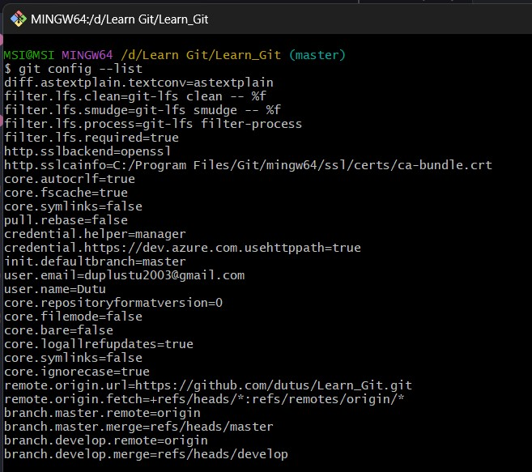
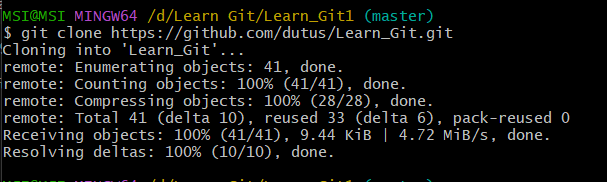
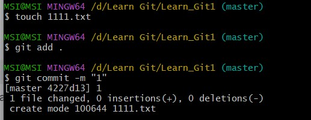
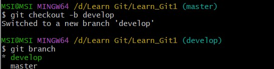
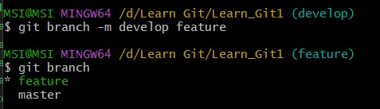
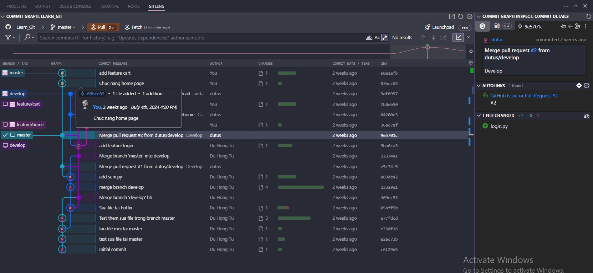

# Tìm Hiểu/Review Kiến Thức Về Git

## 1. Git Là Gì?

Git là một hệ thống quản lý phiên bản phân tán (DVCS) giúp theo dõi các thay đổi trong mã nguồn của dự án. Nó cho phép nhiều người làm việc trên cùng một dự án một cách hiệu quả mà không lo lắng về việc xung đột hay mất dữ liệu.

## 2. Git Làm Được Gì?

- **Theo dõi thay đổi mã nguồn:** Git ghi lại mọi thay đổi trong mã nguồn của dự án.
- **Hỗ trợ làm việc nhóm:** Git cho phép nhiều người làm việc trên cùng một dự án mà không bị xung đột.
- **Quản lý phiên bản:** Git cho phép bạn quay lại các phiên bản trước của mã nguồn nếu cần.
- **Phân nhánh và hợp nhất:** Git hỗ trợ việc tạo và quản lý các nhánh của dự án.

## 3. Các Khái Niệm Cơ Bản
- Repository (repo) là nơi lưu trữ toàn bộ mã nguồn và lịch sử thay đổi của dự án. Một repo có thể được lưu trữ trên máy cục bộ hoặc trên một máy chủ từ xa.

- Object store là nơi Git lưu trữ dữ liệu của repo, bao gồm các đối tượng như blobs, trees, commits, và tags.

- Index (hay còn gọi là staging area) là khu vực tạm thời lưu trữ các thay đổi trước khi commit.

- Branch (nhánh) là một nhánh độc lập của mã nguồn trong repo, cho phép bạn làm việc trên các tính năng hoặc sửa lỗi mà không ảnh hưởng đến nhánh chính.

- Git work-flow là quy trình làm việc với Git, bao gồm các bước như tạo nhánh, commit, merge, và push.


- Staging area là khu vực tạm thời lưu trữ các thay đổi trước khi commit.

**Git & Github & Gitlab Giống/Khác Gì Nhau?**

- **Git:** Là hệ thống quản lý phiên bản.
- **GitHub:** Là dịch vụ lưu trữ mã nguồn sử dụng Git, cung cấp giao diện web và các tính năng cộng tác.
- **GitLab:** Là nền tảng quản lý mã nguồn và DevOps sử dụng Git, cung cấp các tính năng CI/CD và quản lý dự án.

## 5. Các Trạng Thái Có Thể Có Trong Git Repository

- **Untracked:** Tệp mới chưa được theo dõi bởi Git.
- **Modified:** Tệp đã được thay đổi nhưng chưa được thêm vào staging area.
- **Unmodified:** Tệp không có thay đổi nào so với phiên bản đã commit.
- **Staged:** Tệp đã được thêm vào staging area và sẵn sàng để commit.


## 6. Config Cho Git Với Git Config

### 6.1 Config Thông Tin Cá Nhân

```sh
git config --global user.name "Tên của bạn"
git config --global user.email "email@example.com"
```
Sau khi config thông tin cá nhân 


## 7. Các Thao Tác Ban Đầu
### 7.1 Khởi Tạo Repo Với Git Init
```sh
git init
```

### 7.2 Clone Repo Với Git Clone
```sh
git clone <url>
```


## 8. Git Commit
Commit là một bản chụp của mã nguồn tại một thời điểm cụ thể.

Một Commit Chứa Những Thông Tin Gì?
- Thông điệp commit
- Tác giả commit
- Thời gian commit
- Các thay đổi trong mã nguồn



**Amending**
Trường hợp commit nhưng bị quên add một số file nào đó và không muốn tạo ra một commit mới thì có thể sử dụng lệnh commit kết hợp --amend để gộp các file đó và bổ sung vào commit cuối cùng nên không tạo ra commit mới.

## 9. Làm việc với nhánh
- `git branch <branchname>`: Tạo 1 nhánh mới, hoặc có thể sử dụng `git checkout -b <branch>` để tạo 1 nhánh mới và nhảy sang nhánh đó.
- `git checkout <branch>` : Nhảy sang 1 nhánh khác.


- `git branch -m <branch> <branch_rename>` : Đổi tên nhánh.


## 10. Thao tác liên quan khác

### 10.1 Git Merge
Merge (hợp nhất) các thay đổi từ một nhánh khác vào nhánh hiện tại:
```sh
git merge <branch-name>
```

## 10.2 Git Rebase
Rebase giúp áp dụng lại các commit từ nhánh hiện tại lên một nhánh khác:

```sh
git rebase <branch-name>
```
## 10.3 Git Rebase Interactive
Rebase tương tác cho phép bạn chỉnh sửa, sắp xếp lại, hoặc xóa các commit trong lịch sử:

```sh
git rebase -i <base-commit>
```
## 10.4 Git Rebase Khi Remote Có Cập Nhật Mới
Rebase khi có cập nhật mới từ remote:

```sh
git pull --rebase
```
## 10.5 Git Cherry-pick
Cherry-pick cho phép bạn áp dụng một commit từ một nhánh khác vào nhánh hiện tại:
```sh
git cherry-pick <commit-id>
```
## 10.6 Pull
Lấy các thay đổi mới từ remote repository:

```sh
git pull
```
## 10.7 Push
Đẩy các commit từ local repository lên remote repository:

```sh
git push
```

## 10.8 Git Reset
Reset giúp hoàn tác các thay đổi trong repository:

```sh
git reset <commit>
```

# 12. Các Thao Tác Với Git Remote
## 12.1 Add Remote
Thêm remote repository:

```sh
git remote add origin <url>
```
## 12.2 Rename Remote
Đổi tên remote:

```sh
git remote rename origin <new-name>
```
## 12.3 Update Remote
Cập nhật các thay đổi từ remote:

```sh
git fetch <remote>
```
## 12.4 Prune Remote Branch
Xóa các nhánh đã bị xóa trên remote repository:

```sh
git remote prune <remote>
```
# 13. Các Thao Tác Với Stash
## 13.1 Tổng Quan Về Git Stash
Git stash lưu trữ các thay đổi tạm thời để bạn có thể chuyển đổi nhánh mà không mất các thay đổi này.

## 13.2 Git Stash List
Liệt kê các stash hiện có:

```sh
git stash list
```
## 13.3 Git Stash Clear
Xóa tất cả các stash:

```sh
git stash clear
```
## 13.4 Git Stash --help
Xem trợ giúp về git stash:

```sh
git stash --help
```

# 14. Git với giao diện đồ họa
Extension Gitlens của VScode
