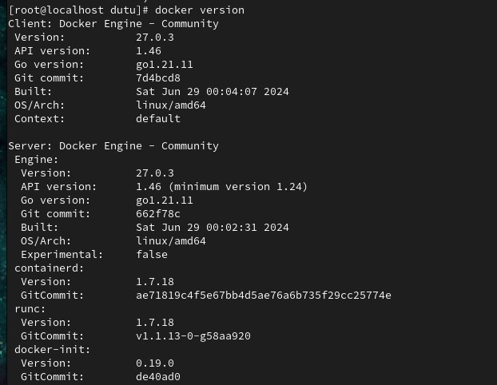
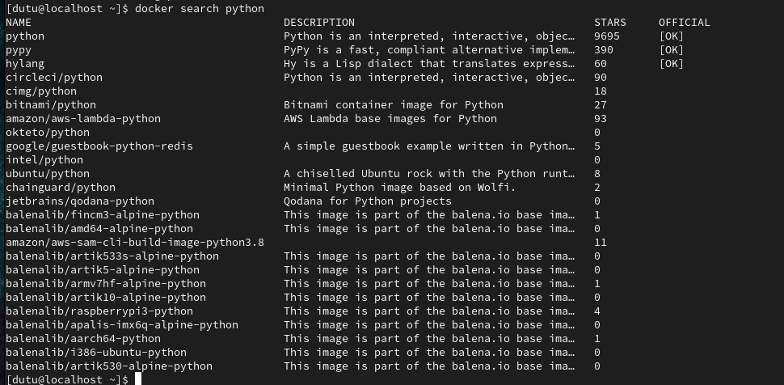
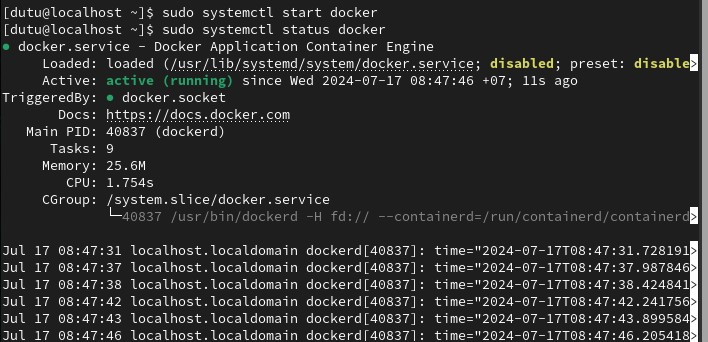
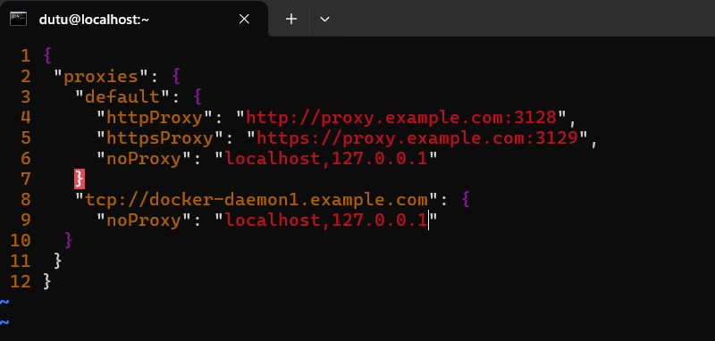

# Docker

### 1. Overview về Docker

Docker là một nền tảng dành cho các developer và sysadmin để **phát triển, triển khai và chạy** các ứng dụng bằng các **container**. Việc đóng gói thành container này giúp cho việc triển khai các ứng dụng trở nên dễ dàng hơn.

Công nghệ container ngày càng phổ biến bởi:
- Linh hoạt: Có thể đóng gói từ ứng dụng đơn giản đến phức tạp
- Nhỏ gọn: Các container tận dụng, sử dụng chung tài nguyên; kernel của host. Có thể chạy ở mọi nơi, mọi nền tảng.
- Khả năng thay đổi linh hoạt: Cập nhật và nâng cấp nhanh chóng.
- Khả năng mở rộng: Dễ dàng tăng và phân tán tự động các container
- Phân tầng dịch vụ: Mỗi dịch vụ khi deploy sẽ được phân tầng, nằm trên các dịch vụ đang có sẵn. Như vậy sẽ không làm ảnh hưởng tới dịch vụ đang chạy.

#### Khái niệm containers và images

- Một container được khởi chạy từ image. Như vậy, image là một gói thực thi chứa bên trong là tất cả những gì cần thiết, liên quan để chạy ứng dụng như mã nguồn, các thư viện, runtime, các biến môi trường và các file cấu hình liên quan.
- Một container là một instance đang chạy được khởi tạo từ image.

#### So sánh giữa VM với container

- Container chạy trực tiếp trên môi trường máy chủ như một tiến trình và chia sẻ phần kernel bên dưới dùng chung với máy chủ chứa nó
- VM tạo ra một môi trường giả lập hoàn toàn tách biệt như 1 máy hoàn chỉnh thông qua việc phân bổ tài nguyên của máy chủ, do đó sẽ tốn tài nguyên nhiều hơn cho hệ điều hành của máy ảo


#### Cấu trúc và thành phần của Docker

Docker bao gồm:

- Docker Client: Giao diện để tương tác giữa người dùng với Docker Daemon - HOST
- Docker Daemon (HOST): Lưu trữ image local và khởi chạy container từ những image đó
- Docker Hub (registry): Nơi lưu trữ các images 

#### Docker Client

Docker client dùng để tương tác giữa người dùng và Docker Daemon,  Daemon sẽ biên dịch và thực thi các câu lệnh đã tương tác qua Docker client.

##### Xem phiên bản đang sử dụng
```sh
docker version
```
Câu lệnh sẽ trả về phiên bản của Docker client và Daemon (server)




#### Tìm kiếm image trên registry
```bash
docker search python
```


- NAME: Tên của Image
- DESCRIPTION: Mô tả về image
- STARS: Số lượt rating. Số này càng cao thì chất lượng của Image càng tốt.
- OFFICIAL: Được cung cấp bởi Hãng hoặc Tổ chức đã được xác nhận trên Registry

### 2. Cài đặt Docker trên CentOS 9 Steam

```sh
sudo yum install -y yum-utils
sudo yum-config-manager \ 
--add-repo \
https://download.docker.com/linux/centos/docker-ce.repo
sudo yum install docker-ce docker-ce-cli docker-compose-plugin
sudo systemctl start docker
```

Kiểm tra xem Docker đã chạy chưa


### 3. Cấu hình proxy cho Docker
- Tạo file config.json trong /etc/docker/
```sh
sudo vim /etc/docker/config.json
```
- cầu hình proxy cho docker client và docker daemon


# Các câu lệnh cơ bản

#### Liệt kê các image

```bash
docker images
```


- `REPOSITORY`: Tên của image
- `TAG`: Phiên bản của image

#### Liệt kê các container

```bash
docker ps  -a
```


`-a` hoặc `--all`: Hiển thị toàn bộ số container có trên hệ thống
- `CONTAINER ID`: ID của container
- `IMAGE`: Tên của Image khởi tạo 
- `COMMAND`: Câu lệnh chính khi khởi động của container/image
- `CREATE`: Thời gian container được tạo
- `STATUS`: Trạng thái của container
- `PORT`: Cổng của container được ánh xạ với host (HOST:CONTAINER)
- `NAMES`: Tên của container

#### Chạy 1 container từ 1 image

```bash
docker run [option] [image] [command]

docker run -d -p 8081:80 game-2048  # Chạy container tỏng chế độ nền (-d) ánh xạ port(-p 8081:80) từ cổng 8081 của máy HOST đến cổng 80 của container
```

#### Build 1 image từ Dockerfile
```bash
docker build [option] [path]

# Ví dụ
docker build -t game-2048:latest .
```
- `-t game-2048:latest` :gắn tag cho image
- `.` : đường dẫn đến thư mục hiện tại.
- `path` : có thể là đường dẫn đến thư mục chứa Dockerfile hoặc địa chỉ URL tới một repository chứa Dockerfile


#### Dừng hoạt động của container
```bash
docker stop [name/container ID]
```
#### Khởi động của container

```bash
docker start [name/container ID]
```

Có thể thêm `-i` để có thể tương tác trực tiếp với container.

#### Tương tác với Container đang hoạt động
```bash
docker attach web1

# Hoặc tương tác sử dụng môi trường `/bin/bash`

docker exec -it web1 /bin/bash
```
#### Xóa container

Container chỉ bị xóa khi ở trạng thái dừng hoạt động.
```bash
docker rm web1
```

#### Kiểm tra các port ánh xạ của container
```bash
docker port [name/containerID]
```


# Kiến thức thêm 
### 1. Docker CE/Docker EE
**Docker CE (Community Edition)**
Là phiên bản miễn phí, sử dụng bởi các nhà phát triển, cá nhân, các tổ chức nhỏ.
Được hỗ trợ thông qua cộng đồng, diễn đàn Docker, GitHub và các tài liệu trực tuyến.

**Docker EE (Enterprise Edition)**
Là phiên bản tính phí, được sử dụng bởi các doanh nghiệp, tập đoàn lớn, yêu cầu bảo mật cao.
Hỗ trợ các giải pháp bảo mật doanh nghiệp, nhận hỗ trợ kỹ thuật từ Docker, cập nhật bảo mật và bản vá lỗi thường xuyên.

### 2. Docker Engine
Docker Engine bao gồm ba thành phần chính: Docker Daemon, Docker Client, và Docker Registry. Mỗi thành phần này đóng vai trò quan trọng trong việc tạo, chạy và quản lý container.

**Docker Daemon (dockerd)**
Docker Daemon là dịch vụ chạy nền chính của Docker. Nó chịu trách nhiệm quản lý Docker containers, images, networks và volumes. Docker Daemon lắng nghe các yêu cầu từ Docker Client thông qua Docker API và thực hiện các yêu cầu đó.
Các chức năng chính:
- Quản lý Containers: Tạo, khởi động, dừng, và xóa các containers.
- Quản lý Images: Kéo (pull), xây dựng (build), gắn thẻ (tag), và xóa các Docker images.
- Quản lý Networks: Tạo và quản lý các networks mà containers có thể kết nối.
- Quản lý Volumes: Tạo và quản lý các volumes để lưu trữ dữ liệu mà containers có thể sử dụng.

**Docker Client (docker)**
Chức năng: Docker Client là giao diện dòng lệnh (CLI) mà người dùng sử dụng để tương tác với Docker Daemon. Người dùng gửi các lệnh Docker qua Docker Client, và Docker Client chuyển các lệnh này tới Docker Daemon để thực hiện.

**Docker Registry**
Chức năng: Docker Registry là kho lưu trữ các Docker images. Nó cho phép người dùng lưu trữ và phân phối các images. Docker Hub là một Docker Registry công cộng phổ biến, nhưng người dùng cũng có thể thiết lập các registry riêng.


### 3. Network trong Docker 

Một trong những điểm mạnh của Docker đó là khả năng kết nối các container để chúng có thể giao tiếp được với nhau và có thể kết nối các container chạy  trên các nền tảng khác nhau. (Linux, Windows,...)

Để liệt kê danh sách Network ở Docker, ta sử dụng câu lệnh sau:

> docker network ls

Để xem các thông tin chi tiết của một Network nào đó, sử dụng câu lệnh:

> docker network inspect <Network-name>

#### Các loại Network trong Docker

Sau khi cài đặt, Docker sẽ tạo mặc định 3 network: `brigde`, `none` và `host`. Khi khởi tạo container, ta có thể chỉ định cho chúng sử dụng network nào thông qua tùy chọn `--network`.

- `brigde`: Network driver mặc định. Mặc định sử dụng `brigde` khi không khai báo trong lúc khởi tạo container. Nó cho phép các container riêng biệt, đơn lẻ (standalone) có thể giao tiếp được với nhau. Dải IP mặc định được cấp cho `brigde` là 172.17.0.0/16
- `host`: Sử dụng thông tin về Network của host cho container. Được hỗ trợ từ phiên bản Docker 17.06 trở lên.
- `none`: Không sử dụng Network trong container.
- `overlay`: là một network driver cho phép kết nối các container nằm trên các Docker Host khác nhau, kích hoạt Swarm sử dụng để truyền thông. Các `overlay` network làm đơn giản hóa việc truyền thông giữa dịch vụ Swarm với container riêng biệt, đơn lẻ hay việc truyền thông giữa 2 container riêng lẻ nằm trên các Docker deamon (Host) khác nhau. Cách này sẽ xóa bỏ việc phải định tuyến (routing) phức tạp ở mức OS giữa các container với nhau.


- `macvlan`: Sử dụng để gán địa chỉ MAC cho container với mục đích là cho container có vai trò như một thiết bị vật lý. Docker daemon sẽ định tuyến luồng gói tin tới các container thông qua các địa chỉ MAC này. Cách này vô cùng hữu hiệu cho các ứng dụng cũ /lỗi thời (legacy app) các kết nối sẽ được chuyển trực tiếp tới lớp Vật lý thay vì phải định tuyến thông qua lớp mạng bên trong Docker.


### 4. Volume trong Docker <a name="4"></a>

*Docker volumes* vô cùng hữu ích với 2 TH muốn lưu trữ và chia sẻ dữ liệu của các container. Điều này vô cùng quan trọng, khi một container bị xóa bỏ có nghĩa rằng mọi dữ liệu bên trong chúng cũng đều bị 'bốc hơi'. Do vậy, để dữ liệu đó không bị mất thì Docker Volume là một tính năng hữu hiệu.

Để sử dụng Docker volume, khi khởi chạy một container hãy thêm tùy chọn `-v` vào sau câu lệnh `docker run`.

#### Khi nào cần sử dụng Volume?

Giả sử, ta có một container làm web server. Khi đó ta sẽ ánh xạ một thư mục trên host để chứa mã nguồn với thư mục `/var/www/html` (thư mục chứa mã nguồn mặc định. Điều này vô cùng hữu ích khi ta muốn cập nhật mã nguồn (thêm xóa dữ liệu) của trang web; thay vì phải vào bên trong container để thao tác, ta có thể thao tác trực tiếp ở thư mục được ánh xạ trên host.

#### Các loại Volume trong Docker

Docker hỗ trợ 3 kiểu Volume như sau:

- Bind mount
- Volume
- tmpfs mount

#### Chi tiết 

 ##### Bind mount 
- **Bind mount**: là một kỹ thuật để ánh xạ trực tiếp một thư mục trên host với một thư mục cụ thể nào đó bên trong container. Khi container bị xóa, dữ liệu bên trong thư mục sẽ không bị ảnh hưởng.

- Sự dụng option `-v hoặc --volume` sau `docker run`: Mount một volume hoặc thư mục từ máy chủ vào container.

##### Volume
- **Volume**: giống với `bind mount` nhưng thư mục ánh xạ sẽ được quản lý bởi Docker. Thư mục chứa mặc dịnh tại `/var/lib/docker/volumes/`
- Tạo Docker Volume: 
```bash
docker volume create [volume_name]
```

##### tmpfs mount
- **tmpfs mounts** được sử dụng trong các trường hợp ta không muốn dữ liệu tồn tại trên Docker host hay containers vì lý do bảo mật hoặc đảm bảo hiệu suất của containers khi ghi một lượng lớn dữ liệu một cách không liên tục.

### 5. Dockerfile <a name="5"></a>

#### Khái niệm

`Dockerfile` là một tập tin dạng text chứa một chuỗi các câu lệnh, chỉ thị để tạo nên một image. Dockerfile bao gồm các câu lệnh liên tiếp thực hiện tự động dựa trên một image có sẵn để tạo ra một image mới. 

#### Câu lệnh trong Dockerfile

`Dockerfile` chứa một tập hợp các câu lệnh bao gồm cả của Docker và các câu lệnh của OS. Trước hết, cần tìm hiểu rõ các câu lệnh của Dockerfile.

- **FROM**: Dựa trên một image có sẵn để tạo ra một image mới. Chỉ thị này phải được đặt ở đầu Dockerfile.
- **MAINTAINER**: (Tùy chọn) Điền thông tin của tác giả, người tạo ra image.
- **RUN**: Chỉ thị dùng để thực thi câu lệnh ở bên trong image
- **ADD**: Dùng để sao chép một file hoặc folder từ Host vào trong image. Có thể sử dụng một URL, Docker sẽ tải về thư mục đích bên trong image.
- **ENV**: Khởi tạo một biến môi trường bên trong image.
- **CMD**: Sử dụng để thực thi một câu lệnh khi tạo container được tạo từ image.
- **ENTRYPOINT**: Chỉ ra một câu lệnh được thực thi khi container chạy.
- **WORKDIR**:  Chỉ ra thư mục làm việc khi tạo image hoặc khi khởi chạy container
- **USER**: Xác định user (UID) thực thi các câu lệnh ở các chỉ thị CMD, RUN, ENTRYPOINT,... được xác định ở phía sau nó.
- **VOLUME**: Cho phép truy cập/liên kết thư mục giữa container với host.
- **EXPOSE**: Khai báo các Port Container sử dụng.
- **ARG**: Khai báo sử dụng tham số khi build image sử dụng câu lệnh `docker build` với cờ`--build-arg <varname>=<value>`


### 6. Docker-compose 

#### Khái niệm

`docker-compose` là một công cụ để tạo, xác định và chạy nhiều container có mối liên quan với nhau trong cùng một thời điểm; được khai báo trong một file với định dạng YAML. Khởi động tất cả các dịch vụ chỉ với 1 câu lệnh duy nhất.

Với 3 bước cơ bản như sau:

- Định nghĩa các ứng dụng thông qua `Dockerfile`
- Định nghĩa các ứng dụng chạy tách biệt và khởi động cùng nhau trong `docker-compose.yml`
- Thực thi câu lệnh `docker-compose up -d` để hoàn tất.

#### Ví dụ về docker-compose
```yml
version: '3.7'

services:
  prometheus:
    image: prom/prometheus
    container_name: prometheus 
    ports:
      - 9000:9090
    volumes:
      - ./prometheus:/etc/prometheus
      - prometheus-data:/prometheus
    command: 
      - --config.file:/etc/prometheus/prometheus.yml

  grafana:
    image: grafana/grafana-oss:latest
    container_name: grafana
    ports:
      - '3000:3000'
    volumes:
      - grafana-data:/var/lib/grafana
    restart: unless-stopped
    depend-on:
      - prometheus
    
volumes:
  prometheus-data:
  grafana-data:
```

- **version:**: Xác định phiên bản của Docker Compose được sử dụng. Phiên bản 3.7 này hỗ trợ nhiều tính năng mới và cải thiện hiệu suất.
- **service**: Phần này định nghĩa các dịch vụ (container) sẽ được khởi chạy. Ở đây là prometheus và grafana.
- **image**: image được sử dụng đề tạo container. Docker sẽ tìm image trong local trước, nếu không có thì sẽ tự pull về từ trên Docker Hub.
- **container_name**: Đặt tên cho container.
- **ports**: Ánh xạ port từ container ra port của local.
- **volumes ( tronng services )**: Gắn kết các thư mục ở local hoặc volume vào trong container.
    ```yml
    volumes:
        - ./prometheus:/etc/prometheus  #Gắn thư mục cấu hình Prometheus từ máy chủ vào container.
        - prometheus-data:/prometheus:  #Sử dụng volume để lưu trữ dữ liệu Prometheus.
    ```
- **command**: Chạy lệnh khi khởi động container.
- **restart**: Đặt chính sách khởi động lại container (unless-stopped), tức là container sẽ tự động khởi động lại trừ khi bị dừng thủ công.
- **depends_on**: Xác định sự phụ thuộc (prometheus), tức là Prometheus sẽ khởi động trước Grafana.
- **volumes (ngoài services)**: Tạo các volumes tại local.


