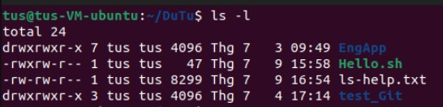
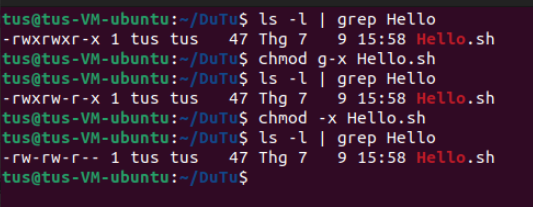
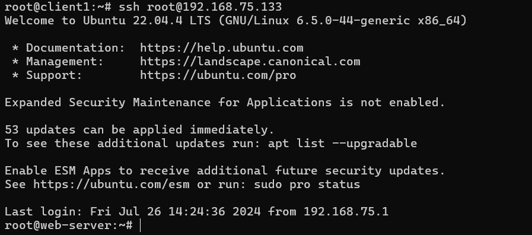

# Linux

## Tổng quan về Linux

Linux là một hệ điều hành mã nguồn mở, dựa trên nhân Linux, được phát triển bởi Linus Torvalds vào năm 1991. Linux được sử dụng rộng rãi trong các máy chủ, thiết bị nhúng và ngày càng phổ biến trên máy tính để bàn và laptop. Một trong những đặc điểm nổi bật của Linux là tính linh hoạt, bảo mật cao và cộng đồng hỗ trợ mạnh mẽ.

## Kiến trúc hệ điều hành Linux

Kiến trúc của Linux bao gồm 3 thành phần chính sau:


1. **Kernel (Nhân):** Thành phần cốt lõi của hệ điều hành,chứa các modules, thư viện để quản lý tài nguyên hệ thống và giao tiếp giữa phần cứng và phần mềm.


2. **Shell:** Là 1 chương trình có chức năng thực thi các lệnh (command) từ người dùng hoặc ứng dụng yêu cầu chuyển đến cho Kernel xử lý. Shell có thể hoạt động thông qua giao diện dòng lệnh hoặc các Script. Các loại Shell:
    - ***Bourne Shell (sh)***: Shell gốc của Unix.
    - ***Bourne Again Shell (bash)***: Phiên bản nâng cao của Bourne Shell, phổ biến nhất trong các hệ điều hành Unix/Linux.
    - ***C Shell (csh)***: Có cú pháp giống ngôn ngữ lập trình C.
    - ***Korn Shell (ksh)***: Kết hợp các tính năng của Bourne Shell và C Shell.
3. **Applications (Ứng dụng):** là các chương trình phần mềm được thiết kế để thực hiện các tác vụ cụ thể cho người dùng. Các ứng dụng thường có giao diện người dùng đồ họa (GUI) hoặc giao diện dòng lệnh (CLI) và chạy trên hệ điều hành. Các ứng dụng thường sử dụng API và dịch vụ hệ điều hành để thực hiện các tác vụ, không tương tác trực tiếp với kernel như shell.


## Kiến trúc cây thư mục của Linux

Hệ thống tập tin của Linux được tổ chức dưới dạng một cây thư mục, với thư mục gốc là `/`. Dưới đây là một số thư mục quan trọng:

- **`/bin`**: Chứa các chương trình thực thi cần thiết cho hệ thống cơ bản.
- **`/boot`**: Chứa các tập tin khởi động, bao gồm kernel.
- **`/dev`**: Chứa các tập tin thiết bị.
- **`/etc`**: Chứa các tập tin cấu hình hệ thống.
- **`/home`**: Chứa các thư mục người dùng.
- **`/lib`**: Chứa các thư viện hệ thống.
- **`/media`**: Thư mục để gắn kết các thiết bị lưu trữ ngoài.
- **`/mnt`**: Thư mục tạm để gắn kết các hệ thống tập tin.
- **`/opt`**: Chứa các ứng dụng tùy chọn.
- **`/proc`**: Hệ thống tập tin ảo chứa thông tin về các tiến trình và hệ thống.
- **`/root`**: Thư mục chính của người dùng root.
- **`/sbin`**: Chứa các chương trình hệ thống dành cho quản trị viên.
- **`/srv`**: Chứa các dữ liệu phục vụ cho các dịch vụ hệ thống.
- **`/tmp`**: Chứa các tập tin tạm thời.
- **`/usr`**: Chứa các ứng dụng và tập tin người dùng.
- **`/var`**: Chứa các tập tin biến đổi, như nhật ký hệ thống và hàng đợi thư.


# Các lệnh cơ bản trong Ubuntu

### 1. Lệnh làm việc với tập tin và file

Dưới đây là một số lệnh cơ bản thường được sử dụng trong Ubuntu:

- `echo` : In nội dung ra màn hình.
- `man` : Hiển thị trang hướng dẫn cho lệnh.
- `ls `: Liệt kê các tập tin và thư mục.


- `cd`: Thay đổi thư mục hiện tại.
    ```bash 
    cd /path/to/directory
- `pwd`: Hiển thị đường dẫn thư mục hiện tại.
- `cp` : Sao chép tập tin hoặc thư mục.
    ```bash
    cp directory/source_file destination
- `mv` : Di chuyển hoặc đổi tên tập tin hoặc thư mục.
- `rm` : Xóa tập tin hoặc thư mục.
- `mkdir` : Tạo thư mục mới.
- `touch` : Tạo 1 tập tin trống.
- `vim/vi/nano` : Mở trình soạn thảo văn bản để tạo, chỉnh sửa tập tin.
- `cat` : In nội dung của file ra terminal.
- `grep` : Tìm kiếm nội dung trong tệp.
- `< , > , >>` : Định hướng nhập xuất.
- `|` : Đường ống là hình thức giao tiếp giữa các tiến trình với cơ chế đầu ra của lệnh này sẽ là đầu vào của lệnh khác.


- `sudo` : (Superuser do) thực hiện lệnh với quyền root.
- `chmod` : Thay đổi quyền truy cập tập tin hoặc thư mục
    ```bash
    chmod mode file
    # mode 
    # r (read): Quyền đọc tệp tin hoặc liệt kê nội dung thư mục.
    # w (write): Quyền ghi vào tệp tin hoặc thay đổi nội dung thư mục.
    # x (execute): Quyền thực thi tệp tin hoặc truy cập vào thư mục.
    # Ví dụ: u+r, g-w, o+x:
    # u (user): Người sở hữu tệp tin.
    # g (group): Nhóm sở hữu tệp tin.
    # o (others): Những người khác.
    # a (all): Tất cả (user, group, và others).
    ```
    

- `chown` : Thay đổi chủ sở hữu của tệp.
    
- `find` : Tìm kiếm file.
    ```bash 
    find path -name file_name   # tìm kiếm theo tên
    find path -inode file_name  # tìm kiếm theo inode
    find path -use file_name    # tìm kiếm theo user
    ```
### 2.Lệnh quản lý tiến trình
- `ps` : Liệt kê các tiến trình đang chạy.
- `top` : Hiển thị các tiến trình đang chạy theo thời gian thực.
- `kill` : Dừng tiến trình đang chạy.
- `reboot` : Khởi động lại hệ thống.
- `shutdown` : Tắt hệ thống.

### 3.Lệnh quản lý người dùng và nhóm
- `adduser` : Thêm người dùng mới.
    ```bash
    sudo adduser username
    ```
- `deluser` : Xóa người dùng.
    ```bash
    sudo deluser username
    ```
- `usermod` : Sửa đổi tài khoàn người dùng.
    ```bash
    sudo usermod -aG groupname username  # Thêm người dùng vào nhóm
    ```
- `groupadd` : Tạo nhóm mới.
    ```bash
    sudo groupadd groupname
    ```
- `groupdel` : Xóa nhóm.
    ```bash
    sudo groupdel groupname
    ```
### 4.Quản lý Gói Phần Mềm trong Linux/Ubuntu

Quản lý gói phần mềm là một phần quan trọng trong việc vận hành và bảo trì hệ thống Linux/Ubuntu. Dưới đây là tổng quan về các công cụ và lệnh quản lý gói phần mềm phổ biến trong Linux/Ubuntu.

#### APT (Advanced Package Tool)

APT là công cụ quản lý gói phổ biến trong các hệ thống dựa trên Debian, bao gồm Ubuntu.

- Cập nhật danh sách gói:
    ```bash
    sudo apt update
    ```
- Nâng cấp tất cả các gói đã cài đặt:
    ```bash
    sudo apt upgrade
- Cài đặt gói mới:
    ```bash
    sudo apt install package_name
- Gỡ bỏ gói:
    ```bash
    sudo apt remove package_name
- Gỡ bỏ gói cùng với các tệp cấu hình:
    ```bash
    sudo apt purge package_name
- Tìm kiếm gói:
    ```bash
    apt search package_name
- Hiển thị thông tin chi tiết về gói:
    ```bash
    apt show package_name
- Tự động gỡ bỏ các gói không còn cần thiết:
    ```bash
    sudo apt autoremove
    ```

#### dpkg (Debian Package)
dpkg là công cụ quản lý gói cấp thấp trong các hệ thống dựa trên Debian. Nó chủ yếu được sử dụng để cài đặt, gỡ bỏ và cung cấp thông tin về các gói phần mềm.

- Cài đặt gói từ tệp .deb:
    ```bash
    sudo dpkg -i package_name.deb
- Gỡ bỏ gói:
    ```bash
    sudo dpkg -r package_name
- Cấu hình lại gói:
    ```bash
    sudo dpkg --configure package_name
- Hiển thị danh sách các gói đã cài đặt:
    ```bash
    dpkg -l
- Kiểm tra tệp gói:
    ```bash
    dpkg -S /path/to/file
    ```

### 5.SSH
#### SSH là gì
- SSH là viết tắt của `Socket Secure Shell` là một giao thức mạng cho phép thiết lập kết nối mạng một cách bảo mật để điều khiển một Linux server từ xa.
- SSH hoạt động tại lớp Application trong mô hình TCP/IP
- SHH được kết nối thông qua cổng mặc định là 22

#### SSH hoạt động như thế nào?
- Khi bạn kết nối thông qua SSH, bạn sẽ có được một phiên hoạt động SSH và có thể giao tiếp với server của bạn từ xa thông qua giao diện dòng lệnh.
- Trong phiên hoạt động, các câu lệnh mà bạn nhập vào trên terminal để yêu cầu server thực hiện đều được gửi qua một kênh SSH đã được mã hóa nội dung
- Mọi kết nối SSH đều được thực hiện trên mô hình client-server. Vì vậy mà để có được một kết nối SSH, thiết bị của bạn buộc phải được cài đặt phần mềm hỗ trợ kết nối SSH (SSH daemon) - Phần mềm này sẽ lắng nghe hoạt động trên các cổng mạng đã khai báo, chứng thực yêu cầu kết nối và sinh ra một môi trường thích hợp cho kết nối SSH

#### Chứng thực người dùng
- Các kết nối SSH từ client đều được chứng thực bởi password "clear text" (bảo mật kém) hoặc sử dụng SSH keys (bảo mật cao)
- Các password "clear text" thường là mật khẩu của tài khoản người dùng được quyền truy cập vào hệ thống remote. Tuy nhiên nó kém bảo mật bởi những hacker có thể thực hiện "brute force" để đăng nhập vào hệ thống qua SSH sử dụng password "clear text". Đây chính là lí do tại sao bạn nên cấu hình lại cách mà SSH chứng thực người dùng.
- SSH keys là một cặp khóa bất đối xứng dùng để xác thực người dùng. Mỗi cặp khóa bao gồm:
    + Public key:
        - Cho phép mã hóa gói tin
        - Được đặt tại server
        - Được phép tự do chia sẻ khóa
    + Private key:
        - Cho phép giải mã các gói tin được mã khóa bởi Public keys
        - Được đặt tại client
        - Phải được giữ bí mật và không được tiết lộ cho bất kỳ ai.
- Để sử dụng SSH keys, một người dùng phải có một cặp khóa SSH trên máy tính của họ. Trên thiết bị remote server, nội dung khóa public phải tồn tại trong thư mục home của người dùng đó trong file `~/.ssh/authorized_keys`.
- Khi một client kết nối tới remote server muốn sử dụng SSH key để chứng thực, client sẽ gửi tới server ý định đó kèm khóa public để sử dụng. Server sẽ kiểm tra nội dung khóa public với nội dung file `authorized_keys`. Nếu khớp nhau, một chuổi bất kỳ sẽ được sinh ra và mã hóa bởi public key và chỉ được giải mã khi có private key. Server sẽ gửi nó tới client để kiểm tra xem liệu client có private key.
- Sau khi nhận được chuỗi mã hóa trên, client sẽ giải mã nó bằng việc sử dụng private key và kết hợp với một chuỗi bất kỳ liên quan đển session ID và sinh ra một MD5 hash gửi ngược trở lại server.

#### Cài đặt SSH và thử kết nối SSH
Trên Ubuntu:
```bash
sudo apt install openssh-client openssh-server -y
```

Trên CentOS
```bash
sudo apt install openssh-client openssh-server -y
```

Trên máy Client thực hiện tạo cặp SSH keys bằng lệnh `ssh-keygen`
```bash
root@client1:~# ssh-keygen
Generating public/private rsa key pair.
Enter file in which to save the key (/root/.ssh/id_rsa):
Enter passphrase (empty for no passphrase):
Enter same passphrase again:
Your identification has been saved in /root/.ssh/id_rsa
Your public key has been saved in /root/.ssh/id_rsa.pub
The key fingerprint is:
SHA256:duvsLKK6IzES3k2pplGQBPouvGChiUI+3KOVAYBJ86E root@client1
The key's randomart image is:
+---[RSA 3072]----+
|B=..             |
|=o+ .            |
|.E..  .          |
|.... o           |
|.++.+   S .      |
|@=o+o. . . .     |
|OO==      .      |
|=o* . . .+       |
| +o+.. . o=      |
+----[SHA256]-----+
```

Các khóa được tạo ra sẽ lưu trong `~/.ssh/` với:
- `~/.ssh/id_rsa`: Đây là khóa bí mật! KHÔNG ĐƯỢC CHIA SẺ FILE NÀY!
- `~/.ssh/id_rsa.pub`: Đây là khóa công khai. Có thể được chia sẻ tự do.

Ở đây tôi thực hiện với người dùng root của máy client.
Sau đó thực hiện copy **public key** lên server bằng lệnh `ssh-copy-id`.


Vậy là đã copy thành công public key cho server và giờ client có thể ssh đến server bằng lệnh `ssh root@192.168.75.133`.


Ở đây tôi có thể ssh tới tài khoản người dùng root vì đã sửa file cấu hình của sshd service trên server. Đường dẫn của file cấu hình `/etc/ssh/sshd_config`. Sau khi chỉnh sửa file cấu hình cần `sudo systemctl restart sshd` để khởi động lại sshd service.
- Tham khảo về các cấu hình **sshd_config**: [tại đây](https://www.man7.org/linux/man-pages/man5/sshd_config.5.html)

# Bash Script
Bash script là một tập hợp các câu lệnh được viết trong ngôn ngữ shell, thường là Bash (Bourne Again SHell), để tự động hóa các tác vụ trên hệ điều hành Unix và Linux. Bash script cho phép bạn kết hợp các lệnh lại với nhau và thực thi chúng như một chương trình đơn lẻ.

## 1.Các loại biến
- Biến môi trường 
- Biến người dùng
- Biến tự động

#### Biến môi trường
Biến môi trường trong Linux rất quan trọng vì chúng lưu trữ thông tin hệ thống cần thiết cho các chương trình và script hoạt động đúng cách.
- Một số biến đặc biệt do hệ thống tạo ra như \$HOME, \$PATH, .... , \$PS1,...
- Một số khác do người sử dụng tạo ra, được đặt trong tệp $HOME/.profile
- Cách tạo biến môi trường của người sử dụng: 
    ```bash
    export <tên biến không có $>=<giá trị biến>
    # Ví dụ: export MYNAME=“Du Tu”
    ```
- `env` : Lệnh xem các biến môi trường.
    
- `printenv` : Lệnh xem giá trị của biến môi trường.
    
- `unset` : Xóa biến môi trường.
    ```bash
    unset VAR_NAME
    ```
#### Biến người dùng
Biến người dùng (User-defined variables) là các biến do người dùng định nghĩa trong các script hoặc trong các phiên làm việc của shell. Chúng có thể là biến cục bộ hoặc biến toàn cục:

- `<tên biến>=<giá trị>` : Gán giá trị cho biến **(trước và sau dấu = không có khoảng trống)**
- `$<tên biến>` : Lấy giá trị của biến.

- **Biến toàn cục**: Được định nghĩa và có thể truy cập từ bất kỳ đâu trong script.

    ```bash
    # Định nghĩa biến toàn cục
    my_var="Hello, World!"
    echo $my_var  # Sử dụng biến toàn cục
    ```
- **Biến cục bộ**: Được định nghĩa và chỉ có thể truy cập trong phạm vi một hàm hoặc một khối lệnh cụ thể.
    ```bash
    # Định nghĩa biến cục bộ trong hàm
    function my_function {
        local my_local_var="I am local"
        echo $my_local_var  # Sử dụng biến cục bộ
    }
    my_function

    #Biến cục bộ trong vòng lặp
    for i in {1..3}
    do
        local loop_var="Loop iteration $i"
        echo "Inside loop: $loop_var"
    done

    # Biến cục bộ không thể truy cập bên ngoài vòng lặp
    echo "Outside loop: $loop_var"
    ```
### Biến tự động
- Biến tự động là các biến do hệ thống tự động tạo ra.
- Biến tự động là biến chỉ đọc, tức là chúng ta chỉ được đọc giá trị của biến tự động và không được gán giá trị cho biến tự động.
- Biến tự động: `$1`, `$2`, …. `$9`
- Biến $0 tham chiếu shell hiện hành
- `$*` *Danh sách các thông số là toàn bộ các tham số dòng lệnh được ghép thành 1 xâu*
- `$#` *Số lượng các tham số - chứa tổng số các tham số dòng lệnh không tính biến `$0`*
- `$$` *Tên tiến trình đính kèm*
- `$@` *Danh sách tham số*
- `$?` *Mã trở lại của lệnh thực hiện cuối cùng Chứa giá trị kết quả trả lại của câu lệnh trước*
- `$!` *Tên của tiến trình được đưa ra sau cùng*

    ```bash
    # Hiển thị tên của chương trình
    echo "Ten chuong trinh: $0"

    # Hiển thị số lượng biến
    echo "So luong bien: $#"

    # Hiển thị các biến tham số đầu tiên
    echo "Bien 1 : $1"
    echo "Bien 2 : $2"

    # Hiển thị tất cả các biến tham số dưới dạng chuỗi đơn
    echo "Tat ca cac bien : $*"
    ```

    Kết quả:
    

- `read <option> <varname>` : đọc giá trị từ bàn phím và gán cho biến.
    ```bash
    read -p "Nhap ten cua ban: " name
    ```

## 2. Các phép toán số học trong Bash Script
Bash script đầy đủ các phép toán số học cơ bản.
```bash
# expr <biểu thức>
expr 4 + 6     # In ra: 10
expr 10 - 10   # In ra: 0
expr 2 \* 2
expr 10 / 5

expr $var1 + $var2

# $((biểu thức))
var=$((4 + 8))   # Gán var = 12
var=$(($var1+$var2))
```

## 3.Các phép toán so sánh
**Toán tử so sánh số học**
- `-eq`: Bằng
- `-ne`: Không bằng
- `-gt`: Lớn hơn
- `-lt`: Nhỏ hơn
- `-ge`: Lớn hơn hoặc bằng
- `-le`: Nhỏ hơn hoặc bằng

**Toán tử so sánh chuỗi**
- `=`  : Bằng
- `!=` : Không bằng
- `<`  : Nhỏ hơn (theo thứ tự từ điển)
- `>`  : Lớn hơn (theo thứ tự từ điển)
- `-z` : Chuỗi rỗng

## 4. Các cấu trúc lệnh if, for, while
**Câu lệnh if**

```bash
if [ điều kiện 1 ] ; then
    # Các câu lệnh thực thi khi điều kiện 1 đúng
elif [ điều kiện 2 ] ; then
    # Các câu lệnh thực thi khi điều kiện 2 đúng
else 
    # Các câu lệnh thực thi khi các điều kiện sai
fi
```

**Câu lệnh for**

```bash
for variable in list
do
    # Các câu lệnh thực thi với mỗi giá trị trong danh sách
done
```

**Câu lệnh while**

```bash
while [ điều kiện ]
do
    # Các câu lệnh thực thi khi điều kiện đúng
done
```

### 5.Ví dụ chương trinh đơn gian
**Chương trình test if,while**
```bash
!/bin/bash

read -p "Ten ban la gi? " name
echo "Chao $name"
while true
do
        sleep 1
        read -p "May bao nhieu tuoi? " age
        if [ $age -lt 18 ]; then
                sleep 1
                echo "Cam nguoi duoi 18 tuoi"
                break
        else
                sleep 1
                echo "May boc phet"
        fi
done
```
Kết quả:


**Chương trình khởi tạo 1 terminal cá nhân**
```bash
#!/bin/bash

echo "Welcome to the simple shell. Type 'exit' to quit."

# Vòng lặp vô hạn để liên tục đọc và thực thi lệnh
while true; do
    # Hiển thị dấu nhắc và đọc lệnh từ người dùng
    read -e -p "simple_shell:$(pwd)> " command

    # Kiểm tra nếu lệnh là 'exit' thì thoát khỏi vòng lặp
    if [ "$command" == "exit" ]; then
        break
    fi

    # Thực thi lệnh người dùng nhập
    eval $command

    # Kiểm tra nếu lệnh thực thi không thành công
    if [ $? -ne 0 ]; then
        echo "Error: Command failed to execute."
    fi
done

echo "Goodbye!"
```

Kết quả :

